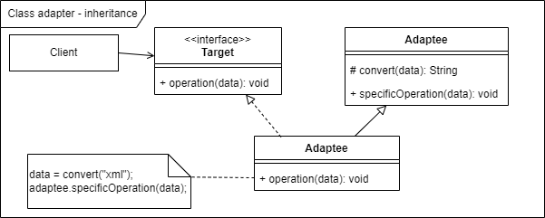

# Adapter pattern
## Bài toán
1. [x] Bạn có 1 điện thoại dùng cổng sạc mirco USB và dây sạc hỗ trợ USB type C. Vậy làm sao để sạc được?  
   
Phương án 1: đổi dây sạc khác  
Phương án 2: đổi điện thoại khác  
Phương án 3: dùng một đoạn cáp chuyển đổi nhỏ cho dây sạc _ đổi USB type C thành micro USB.  
  
=> Cân nhắc đến chi phí, tính tiện dụng => Phương án 3 là perfect nhất.

Và tinh thần của adapter cũng tương tự như phương án 3 kia.

## Định nghĩa:
Adapter pattern là:
- Là một structure design pattern
- Cho phép các interface không tương thích kết hợp được với nhau
- Cho phép 1 interface được dùng bởi interface khác.
- Thường không muốn sửa code đã có để thiết kế hay trách nhiệm của các lớp ban đầu không bị chỉnh sửa

Ưu:
1. [ ] Single reposibility: Tạo class adapter làm nhiệm vụ kết nối, không thay đổi trách nhiệm các class cũ   
-> giữ được tính bao đóng, đơn nhiệm, đơn giản, dễ hiểu  
-> Maintain tốt
2. [ ] Class xử lý được tách ra độc lập -> O in SOLID: Open for extensions, close for modification
3. [ ] Re-use tốt, vì xử dụng lại các interfaces đã có      

## Hiện thực
Có nhiều các hiện thực, có thể có 3 cách để chuyển một interface thành interface khác mà client mong đợi:
1. Dùng inheritance: class adapter  

2. Dùng composition: object adapter  
   

3. Dùng nested class  
   

Khác nhau giữa các cách trên là 
1. [x] Về mức độ bao đóng hay coupling của chúng.
- Nest class: truy cập được mọi member variables (private, protected, public) của class Adaptee
- Inheritance: truy cập được ít hơn (public, protected)
- Composition: truy cập được ít hơn nữa (public)  
  => Tính single responsibility của chúng tăng dần theo thứ tự trên
  => Tương ứng khả năng mở rộng  
2. [x] Nếu bạn dùng nested class bạn phải sửa code trong class adaptee -> Điều này có lúc không được chẳng hạn adaptee thuộc về một library khác.
3. [x] Composition với inheritance thì composition linh hoạt hơn vì loose coupling hơn. 
 [Chi tiết](https://github.com/hazoe-dev/samples_effective_java/blob/main/documents/Inheritance_with_Composition.md)

## So sánh
So sánh Adapter với decorator pattern, ta có:

| Tiêu chí                  |      Adapter       |             Decorator |
|---------------------------|:------------------:|----------------------:|
| Tinh thần                 | Convert interface  |    Thêm tính năng mới |
| Maintain, hiện thực       | Đơn giản: ít class | Phức tạp: nhiều class |
| Flexible: re-use, extend  |       ít hơn       |             nhiều hơn |

##Code
Example for adapter:
https://github.com/hazoe-dev/samples_effective_java/tree/adapter-pattern/src/main/java/adapter_pattern

