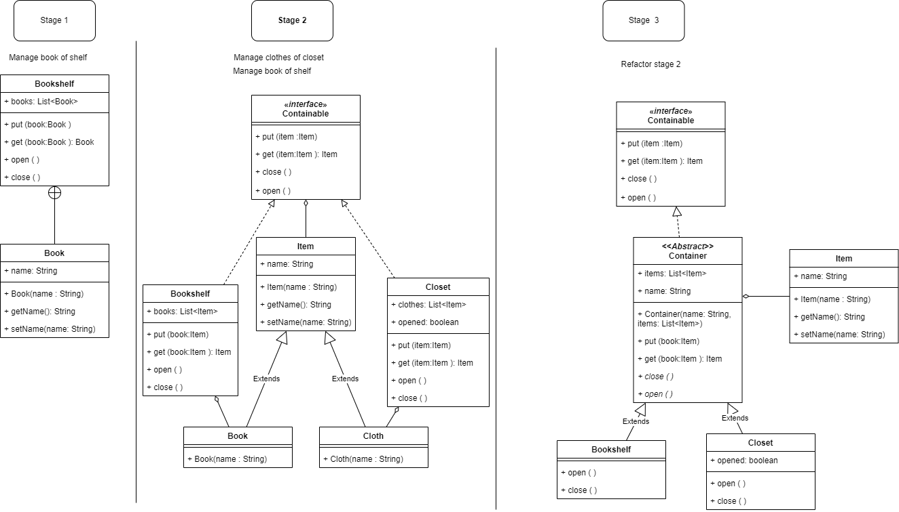

# Skeletal implementation   
Công thức: kết hợp của interface và abstract class.  
Vậy tại sao lại cần sự kết hợp này?  

## Abstract class
-Hỗ trợ re-use code dạng kế thừa (inheritance)  
**Ưu điểm:**  
1. [x] Cho bạn **implement method trong class abstract** hoặc khai báo abstract method (class abstract không thể new)
2. [x] **Chỉ có class con** mới có được kế thừa implement hay get implement methods từ class cha: Tính bao đóng

**Hạn chế:**
1. [x] Java chỉ có **đơn kế thừa** (single inheritance), một class chỉ có duy nhất 1 class cha.   
Mà chỉ có class con mới được kế thừa method của class cha, bạn bị hạn chế về sự linh hoạt.
2. [x] Nếu bạn dùng abstract class, tức là inheritance, bạn phải **hiểu** design của nó.   
Vì bạn có thể kế thừa implement methods từ class cha nên bạn phải biết nó làm gì. Nếu không sẽ dẫn đến bạn bị sai logic do gọi một method của class cha mà không rõ nó đã xử lý gì trước đó.
   Ví dụ: bạn kế thữa HashMap và hiện thực lại add, addAll method -> bạn không biết addAll gọi add nên bạn bị sai logic ở addAll.  
Và điều này không dễ để nhận ra trong nhiều trường hợp.   
Vậy nên nếu dùng inheritance bạn cần design rõ ràng hay document cho phần hiện thực.
3. [x] Nếu lớp bạn extends thuộc một **package** khác, bạn phải public interface để truy cập được -> nhưng không nên làm điều này vì nó phá vỡ tính đóng gói.  

## Interface
Re-use code với interface  
**Ưu điểm:**  
1. [x] Bạn có thể mở rộng interface cho **bất kì lớp nào**, không nhất thiết là lớp con.
2. [x] **Không có phần hiện thực**  
Dẫn đến:  
   3. [x] Interface rất linh hoạt -> Mỗi implement class là 1 implement riêng, single responsibility -> **an toàn hơn**  
   4. [x] Interface **không quan tâm đến cây phân cấp**  
   -> Bạn có thể kết hợp interface Singer với interface SongWriter   
   => Nếu requirement xuất hiện một ca sĩ biết sáng tác  
   -> Ta có SingerSongWriter => interface cho ta ghép tổ hợp chập các class linh hoạt hơn cây phân cấp  
   -> Không bị bùng nổ classes khi muốn kết hợp -> re-use tốt
   5. [x] Interface **mô phỏng đa kế thừa**  
   -> Bạn có thể implements nhiều hơn 1 interface   
   -> Bạn có thể implement method of interface ở class chắt chút chít  
   -> Vậy nên mixins là một primary function có thể được chỉnh sửa khác nhau tùy thuộc class hiện thực.  
   Vd: bạn implement Comparable bằng AgeComparator -> bạn mở rộng so sánh với AgeAndNameComparator  
   -> Interface flexible

**Hạn chế:**  
1. [x] Interface **khó enhance mở rộng hơn** abstract class.  
Vì khi add một new method cho interface -> buộc tất cả các implement class của nó phải implement cho new method   
-> nếu không sẽ bị lỗi compile  
-> Ảnh hưởng đến tất cả các lớp hiện thực -> Bạn phải sửa rất nhiều  
   Nhưng nếu là abstract class, bạn có thêm default implement cho new method  
-> Hạn chế được tác động đến các lớp con ngoại trừ class cần override lại new method trên.
2. [x] Interface một khi **public sẽ không thể sửa đổi** được.  
Bạn sẽ không thể hôm nay support cho một public method, ngày mai không   
-> vì client class khác đang dùng, bạn không thể can thiệp vào sửa code của họ,
   càng vì bạn không biết họ dùng như thế nào, ở đâu bởi tính đóng gói, che dấu thông tin  
Để hạn chế sửa khi đã public, hãy implement nhiều nhất có thể cho public method đó để kịp thời sửa khi còn có thể.

## Skeletal implementation
Nhìn hai anh lớn phía trên có ưu, có nhược => Giờ mình có cái công thức kết hợp ưu điểm của cả hai cho mạnh mẽ.  

Convention cho tên class là **Abstract*Interface***, với interface là cái quan trọng bạn muốn dùng.   
Ví dụ: Abstract*List*, Abstract*Map*, Abstract*Collection*  
Bạn có thể thay là SkeletalInterface mà đó giờ người ta quen cái cũ rồi a.

À mặc dù công thức là vậy, nhưng nếu bạn thay abstract class thành 1 class bình thường cũng được nha. 
Tùy thuộc vào requirement bạn có thể thay đổi tùy chỉnh thêm bớt cho phù hợp. Vd: AbstractMap.SimpleEntry  

Vẻ đẹp của bộ khung trên:  
1. Bạn có implement trong abstract class nên nếu bạn mở rộng enhance interface với new method có thể giảm tác động break compile của các class impl nó.  
Vì bạn có thể khai báo 1 impl cho new method trong abstract ⇒ những class không thay đổi logic có thể không bị ảnh hưởng.
2. Kế đến, bạn muốn hiện impl của interface ở class con hay cháu đều ok.  
3. Giờ re-use code thích hơn nha, bạn có impl trong abstract class làm cái khung rồi, 
giờ cái nào cần dùng thì override không thì để cho class cha xử lý exception hay logic căn bản đều ok.

Ví dụ minh họa:  
1. [ ] Với requirement **stage 1**: chỉ manage book on the shelf  
2. [ ] Với requirement **stage 2**: manage book on the shelf và mở rộng thêm manage clothes on the closet  
3. [ ] **Stage 3**: Giờ bài toán y cũ, mình thấy bị lặp code impl nên refactor với skeletal implementation  

  

Code mình để ở đây:  
https://github.com/hazoe-dev/samples_effective_java/tree/skeletal_implementation/src/main/java/skeletal_implementation/example
