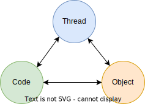

# Thread và Swing
### Tổng quan
- Nhận thức về thread tạo ra một bức tranh rõ ràng về cách một chương trình hoạt động.
- Thread, code và object có mối quan hệ chặt chẽ với nhau.  
  

### Thread
- Hệ điều hành cung cấp các dịch vụ để chạy và quản lý các ứng dụng cùng tài nguyên hardware của máy tính.
- Các chương trình thường độc lập với nhau để không bị lỗi không mong muốn và chạy trên những process độc lập.
- Nếu chỉ có một process thì khoảng thời gian chờ đợi từng task thực hiện xong mới thực hiện task khác
  sẽ dẫn đến tình phản hồi thấp.  
  Vậy nên chương trình có thể có nhiều process trên những ngôn ngữ không dùng khái niệm thread như javascript.  
  Vấn đề là giao tiếp giữa các process rất khó khăn.  
  Thread ra đời là để chia sẽ data giữa những task trong process dễ dàng hơn mà vẫn thực hiện được chạy song song các task trên những threads khác nhau.
- Từ đó, có bài toán multiple thread để giải quyết vấn đề tính phản hồi.
- Thực chất, các thread hay process được thực hiện tuần tự, nhưng nhờ có hệ điều hành điều phối (switch context) với những nguyên tắc phân chia tài nguyên hiệu quả,  
  sẽ trông giống như các task được chạy song song vì thời gian switch rất nhỏ.

### Mối quan hệ giữa thread - code - object
Cụ thể:

#### Object và code
- **Object** là một thể hiện (instance) của một class
- **Class** là một bản thiết kế.  
  Trong OOP, class không chỉ đóng gói của một loại thực thể trong thực tế vào chương trình mà còn có mục đích chính yếu
  là một công cụ để thiết kế và lập trình chương trình một cách hiệu quả, cụ thể như để đảm bảo tính chất maintainable, reusable, extendable.

Class thường bao gồm những:
- **data**/properties/đặc trưng
- **behavior**/method/algorithm và logic .    
  -> Giúp tổ chức các thành phần trong chương trình,   
  ví dụ chương trình quản lý xe trong cửa hàng được tổ chức thành class Car, Bill...

- Object phản ánh một _thực thế cụ thể_ từ class, đóng gói 1 instance trong một _ngữ nghĩa cụ thể_.  
  Được truy xuất thông qua biến, với biến là nơi lưu trữ tham chiếu đến địa chỉ của object được lưu trong vùng nhớ heap.  
  VD: Car redCar = new Car("red", "2015");
- **Code** là một tập hợp lệnh hiện thực:
    - Behavior của object (của class)
    - Tương tác giữa các object

##### Kết luận:
- Object chứa code
- Code chứa kịch bản/ logic hiện thực behavior của object

#### Code và thread
- **Thread** là **đơn vị thực thi** nhỏ nhất trong một bộ xử lý (process), mỗi chương trình (program) chạy trên một process độc lập.
- Code được viết bằng ngôn ngữ lập trình (vd: java, c+, python...)
    * Chứa tập lệnh thực thi một nhiệm vụ (function) bằng logic và algorithm:
        * Cái con người hiểu được
        * Cái máy tính có thể thực thi
- Ngoài ra, tập lệnh trong code có thể định nghĩa cách quản lý và hành vi của thread: create, delete, stop, start, tương tác.

##### Kết luận:

- Code đóng vai trò trung gian cho giao tiếp giữa người và bộ xử lý máy tính, phản ảnh ở mức cao tập lệnh hay kịch bản con người muốn máy làm:
    - Code chạy trên thread
    - Thread chạy code để thực thi một nhiệm vụ cụ thể

#### Thread và object
- Nhưng thread muốn chạy thì code là không đủ vì muốn chạy code:
    - Không chỉ cần tập lệnh / kịch bản của code
    - Mà còn cần input/data/đối tượng chịu tác động/ đối tượng phản ánh thay đổi/ ngữ nghĩa để tương tác với máy

##### Kết luận:

- Object chính là phần trung gian đó:
    - Thread muốn chạy code thì cần truyền code vào thread nhưng code không đứng độc lập,
      code cần ngữ nghĩa, code cần là hành vi của một object cụ thể, code cần input cho hành vi,
      cần nơi lưu trữ thay đổi, code cần nằm trong một object   
      -> _Thread thực thi code thông qua object_
- Nếu đặt object trong multiple threads, thì object còn đóng vai trò lưu trữ dữ liệu cái được chia sử giữa các thread   
  -> Object giúp threads chia sẻ tài nguyên

#### Xét mối quan hệ thread - code - object trong thực tế
1 thread - 1 code - 2 objects: nghĩa là

2 threads - 2 code - 1 object: nghĩa là

### Tính ứng dụng
Vậy góc nhìn về thread-code-object mang lại cho ta lợi ích gì:
- Hiểu về mối quan hệ trên giúp ta dùng thread hiệu quả hơn trong bài toán multiple threads.   
  Hệ điều hành sẽ quyết định khi nào thread nào được chạy, nên khi làm việc với thread ta không thể biết được khi nào thread thật sự chạy.
- Hiểu hơn về cách hoạt động các thành phần trong chương trình để dùng phù hợp:
    - Thread là máy thực thi lệnh,
    - Code định nghĩa tập lệnh,
    - Object là ngữ nghĩa (semantic) phản ánh một đối tượng được trừu tượng hóa và đưa vào trong chương trình để xử lý, đóng gói một dữ liệu đặc trưng và mô phỏng hành vi của đối tượng
- Khi hiểu được thread, code và object khác nhau như thế nào, bạn sẽ có thể cân nhắc khi nào thì nên quan tâm đến vấn đề đồng bộ trong **multiple threads**:
    - Nếu bạn đang work trên 1 thread với 1 code,  2 objects khác nhau thì không vấn đề gì
    - Nhưng nếu bạn dùng 2 threads với 1 code,  1 object thì nên cân nhắc trường hợp xử lý deadlock hay tranh chấp tài nguyên,
      vì các threads có khả năng chia sẻ tài nguyên thông qua objects trong bộ nhớ heap.

##### Xét trường hợp nhiều threads chạy, ta có khả năng thực hiện song song, đồng thời nhiều nhiệm vụ cùng lúc nhằm tăng tính phản hồi của chương trình

1. 2 threads chạy 2 objects khác nhau -> tương tác trên hai ngữ nghĩa khác nhau -> tạo kết quả độc lập cho từng object    
   => ta thấy code chạy đồng thời
2. 2 threads chạy song song nhưng 2 lần chạy cần tác động chung trên một object (ngữ nghĩa)  
   Phải đảm bảo kết quả đúng, là luôn ra cùng một kết quả có thể đoán định cho mọi lần chạy (consistent)  
   Ta cần đồng bộ (synchronization mechanism)   
   Ví dụ, ta có list 10 học sinh cần lưu vào một object Cource, trước khi lưu cần chuyển đổi một vài data   
   Ta tách list trên làm 2 nhóm cho 2 thread xử lý đồng thời, giảm thời gian thực thi của phần convert data này xuống một nửa  
   Khi cập nhật vào list, nếu để thread chạy tự nhiên thì không biết được thứ tự sinh viên bị thay đổi như nào, mà ta muốn giữ thứ tự học sinh theo nhóm,  
   Vậy ta khóa list (synchronize) trong Cource để list này được thực hiện lần lượt

##### Dùng nhiều threads
- Giúp tăng tốc độ phản hồi của chương trình   
  VD: một máy chỉ xử lý được một require của một user,   
  Giờ có 2 threads, giống như có 2 máy, bạn có thể xử lý cho 2 users cùng lúc  
  Giảm bớt thời gian chờ của user

- Có 2 trường hợp:
    - 2 nhiệm vụ không liên quan gì đến nhau như 2 users khác nhau cập nhật 2 mật khẩu độc lập
    - Nhưng nếu 2 nhiệm vụ liên quan hay ta cần 2 threads tương tác với nhau thì cần phải làm sao:
        - Cùng cập nhật trên một shared object -> đảm bảo task 1 xong là complete thì task 2 mới chạy trên the shared object hoặc ngược lại  
          Đảm bảo tính toàn vẹn của một nhiệm vụ không bị thay đổi
        - Phải đảm bảo kết quả mỗi lần đến như nhau
        - Ví dụ: cập nhật tài khoản người chuyển và người nhận phải cùng được cập nhật thành công ở 2 object tài khoản khác nhau.  
          Ta dùng synchronize cho 2 objects -> nhưng sẽ tốn thời gian và tài nguyên chỗ này.
