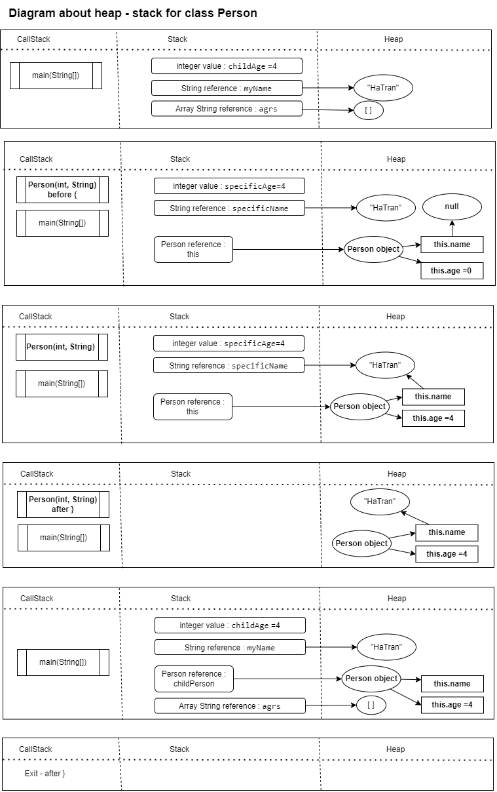

# Garbage collector

Trước khi tìm hiểu về GC, bạn cần xem cách Java lưu trữ biến và giá trị của biến như thế nào?
## Heap and stack memory

Ta có:

    public class Person {
        int age;
        String name;
    
        public Person (int specificAge , String specificName)
        {
            this.age = specificAge;
            this.name = specificName;
        }
    
        public static void main(String[] args) {
            int childAge = 4;
            String myName = "HaTran";
    
            Person childPerson = new Person(childAge, myName);
        }
    }

Vậy trên heap, 1 Person khoảng bao nhiêu byte nếu 1 reference object giả sử là 8?  
- Person object : this = 12 byte , gồm:  
  - String : name = 8 byte  
  - int : age = 4 byte  
  => Tổng là 12 byte

> - Heap: chứa giá trị của các biến
> - Stack: 
>  - Primitive variable: tên biến và giá trị của biến đó có kích thước primitive data type tương ứng
>  - Reference variable: stack chứa tên biến và địa chỉ của giá trị biến đó trong heap

> - Stack: chứa local/method variable or giá trị primary type
> - In java, truyền tham trị (argument not parameter)

**GC quản lý Heap Memory, khi một giá trị trong heap không được dùng, tức là không được trỏ đến nữa thì GC sẽ hủy giá trị đó.**

GC không chỉ hủy các giá trị dư thừa mà còn sắp xếp lại không gian nhớ.  
Cụ thể là, GC tìm trong stack xem có biến nào trỏ đến phần tử trong heap đang duyệt không?  
Nếu không thì remove nó. Không chỉ remove mà GC còn dồn các vùng nhớ trong heap lại để có những khoảng trống rộng hơn, phù hợp với nhiều giá trị mới hơn.  
Mà quá trình trên hoàn toàn được che dấu bởi GC, ta chỉ cần dùng mà không phải bận tâm về lỗi đầy heap hay phân mảnh heap.  
Giải phóng sức lực và cách thức trình bày code. Bạn không cần dọn dẹp heap, bạn không cần làm phức tạp code bằng việc phải liên tục hủy đối tượng. Điều đó làm Java lấp lánh nổi bật giữa những ngôn ngữ lập trình khác.

## Cách dùng:
Bạn hãy quên nó đi.  
Đó là phần việc của GC. Bạn không nên can thiệp. Kể cả bạn có gọi GC (System.gc) thì không chắc là nó sẽ được chạy ngay khi bạn gọi, vì đó không phải việc bạn biết rõ mà can thiệp.   
GC hiểu rõ heap của bạn hơn bạn.
Có nhiều loại GC khác nhau chọn cái nào tùy thuộc vào nhu cầu của bạn.  
Riêng mình, mình cảm thấy việc làm của GC rất có giá trị và thầm lặng. Nó mang lại một sự giải phóng khỏi việc dọn dẹp vùng nhớ heap, giúp việc viết code chỉ tập trung vào business logic tức functional tốt hơn.  
Đây là đứng trên vai những người khổng lồ và hiểu về GC khiến mình biết ơn về thành quả lao động của những người đi trước nhiều hơn. Bóng mát không tự nhiên mà có, mà ai đó đã trồng cây.  

