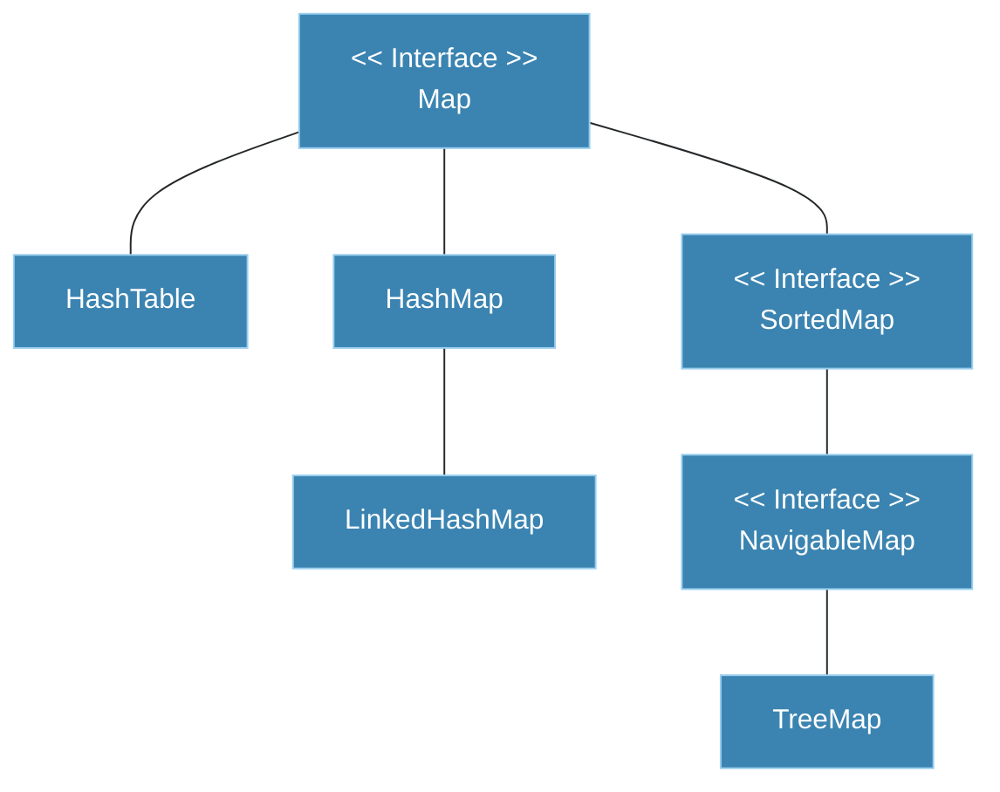
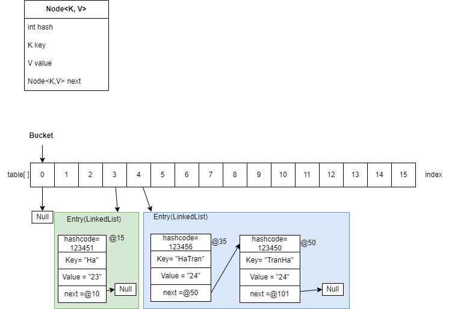

# Equals and Hashcode

### Equals

Là một hàm định nghĩa sẵn trong class Object.
Giống như so sánh bằng, equals trả lời một đối tượng nào đó có bằng nhau với đối tượng này hay không.

#### Cách dùng

Bạn cần trả lời vài câu hỏi.

##### Equals dùng để làm gì?

So sánh hai đối tượng và kết luận chúng bằng nhau không.
Nhưng có hai kiểu bằng nhau:
1. **Identity**: 2 đối tượng trỏ đến cùng vùng nhớ thì bằng nhau.
2. **Equivalence** relation: quan hệ tương đương của các đối tượng khác null để so sánh những attribute của 2 đối tượng nếu chúng tương đương thì bằng.
   Cái này mình hay dùng cho tập hợp **Set** để đảm bảo không tồn tại giá trị trùng nhau trong tập hợp. Còn Set mình hay dùng là **key**.

##### Khi nào cần override?

Bạn không cần override nếu:
* Lớp cha đã có hàm equals bạn muốn. Vd: bạn check 2 đối tượng class Random để chắc rằng nó khác với cái trước đó nhưng nếu vậy thì hàm mặc định của Object là đủ.
* Bạn không quan tâm giá trị - values. Vd Thread, mỗi đối tượng nên là duy nhất - unique.
* Bạn không cần định nghĩa khi nó không thể được gọi. VD: equals trong private class.

Nếu bạn muốn so sách bằng cho giá trị thì override:  
Vì đây là common method trong Object class nếu nếu định nghĩa bạn phải tuân thủ general contract để các lớp khác có thể vận hành đúng. Ví dự như HashMap.

###### General contract :

1. x.equals(x) = true : **Reflective** - phản xạ
2. x.equals(y) = y.equals(x) : **Symmetric** - đối xứng
3. x.equals(y) && y.equals(z) = true => x.equals(z) = true : **Transitive** - Tính nối
4. x.equals(x) = true, time in this method. => **Consistent**
5. x.equals(null) = false.

##### Điều gì xảy ra khi vi phạm contract:
######   Với Symmetric, bạn có thể bị vi phạm khi dùng inheritance
Example:
https://github.com/hazoe-dev/samples_effective_java/tree/common-method/samples_effective_java/src/common_method/equal_hashcode

```
public class Book {
    String name;
    int numberPublish;
    String author;

    public Book(String name, int numberPublish, String author) {
        this.name = name;
        this.numberPublish = numberPublish;
        this.author = author;
    }

    @Override
    public boolean equals(Object o) {
        if (this == o) return true;
        if (!(o instanceof Book))
            return false;
        Book book = (Book) o;
        boolean nameEqual = (this.name == null && book.name==null)||(this.name!=null && this.name.equals(book.name));
        boolean authorEqual = (this.author == null && book.author==null)||(this.author!=null && this.author.equals(book.author));
        return numberPublish == book.numberPublish && nameEqual && authorEqual;
    }
    //other methods
}

public class SelfHelp extends Book{
    private int quantityBook;

    public SelfHelp(String name, int numberPublish, String author, int quantityBook) {
        super(name, numberPublish, author);
        this.quantityBook = quantityBook;
    }

    @Override
    public boolean equals(Object o) {
        if (this == o) return true;
        if (!(o instanceof SelfHelp)) return false;
        if (!super.equals(o)) return false;
        SelfHelp book = (SelfHelp) o;
        boolean nameEqual = (this.name == null && book.name==null)||(this.name!=null && this.name.equals(book.name));
        boolean authorEqual = (this.author == null && book.author==null)||(this.author!=null && this.author.equals(book.author));
        return quantityBook == book.quantityBook && numberPublish == book.numberPublish && nameEqual && authorEqual;
    }
     //other methods
}

public class BookStore {
    public static void main(String[] args) {
        Book book1 = new Book("Habits", 2019, "James");
        SelfHelp selfHelpBook = new SelfHelp("Habits", 2019, "James", 100);

        boolean b1 =selfHelpBook.equals(book1);//false : expected
        boolean b = book1.equals(selfHelpBook); //true : wrong

        System.out.println((b1==b) +" =>violate symmetric because use instanceof with inheritance" );
    }
}
```


**Fix = compositions -> Favor composition over inheritance**

```
public class Book {
    String name;
    int numberPublish;
    String author;

    SelfHelp selfHelp;

    public Book(String name, int numberPublish, String author, SelfHelp selfHelp) {
        this.name = name;
        this.numberPublish = numberPublish;
        this.author = author;
        this.selfHelp = selfHelp;
    }

    @Override
    public boolean equals(Object o) {
        if (this == o) return true;
        if (!(o instanceof Book))
            return false;
        Book book = (Book) o;
        boolean nameEqual = (this.name == null && book.name==null)||(this.name!=null && this.name.equals(book.name));
        boolean authorEqual = (this.author == null && book.author==null)||(this.author!=null && this.author.equals(book.author));
        boolean selfHelpEqual = this.selfHelp.equals(((Book) o).selfHelp);
        return numberPublish == book.numberPublish && nameEqual && authorEqual && selfHelpEqual;
    }
```

**Fix = good equals  
Trong class Book:
```
@Override
    public boolean equals(Object o) {
        if (this == o) return true;
        if (o == null || getClass() != o.getClass()) return false;
        Book book = (Book) o;
        boolean nameEqual = (this.name == null && book.name==null)||(this.name!=null && this.name.equals(book.name));
        boolean authorEqual = (this.author == null && book.author==null)||(this.author!=null && this.author.equals(book.author));
        return numberPublish == book.numberPublish && nameEqual && authorEqual;
    }

```


### Hashcode

Tương tự như trên, hashcode() là method có sẵn trong Object class.  
Vì vậy khi dùng, ta cũng phải tuân thủ general contract để không xảy ra lỗi ở những class có dùng method này.   
Cụ thể là **hash-base collections như HashMap, HashTable, HashSet**.

Ồ như vậy, nếu bạn không dùng đến hash thì mọi thứ vẫn chạy ro ro đúng không.  
Nhưng nếu một ngày đẹp trời, bạn lấy một HashMap object dễ thương ra dùng và một bé bug có thể gây rắc rối đấy. Bạn có thể sẽ không nhìn thấy rủi ro ở đây nữa cơ vì tâm trí bạn là một function khác rồi a!  
Vậy nên ta có rule sau:  
**Nếu override equals(), mình luôn phải override thêm hashCode()**!

###### Contract của hashCode:

1. Nếu gọi cùng một đối tượng lần thứ bao nhiêu đi nữa thì chỉ có 1 hash code thôi trên cùng 1 application đang chạy.
2. Hai object theo equals là bằng nhau thì có cùng hash code.
3. Hai object theo equals là không bằng thì không nhất thiết khác hash code. Nhưng nếu khác thì sẽ tối ưu được hiệu suất tìm kiếm của hash table.

###### Hiện thực hashCode

* Thỏa điều 1,2 thì có thể luôn trả về một constant là 17 chẳng hạn.
* Muốn đáp ứng được cả hai object khác nhau theo equals thì hash code khác nhau bạn có một gợi ý tạo good hashCode sau:

1. Chọn một constant ví dụ 17
2. Chọn các significant attribute theo business logic của bạn.
3. Tính giá trị cho các attribute như sau:
    * Nếu là primitive: chuyển về số nguyên kiểu int
    * Nếu là reference: tính từ các attribute của nó, phức tạp quá cho luôn một contant
    * Nếu là array: hashcode = hashcode * constant  + elementHashCode ; nó giống vầy nè:  [result = result  * 31  +c]
7. Return
8. Test

###### Vậy thì tại sao hashCode phải đi chung với equals và thỏa những contract trên?

### Hash Table

Ta tìm hiểu thêm Hash Table

#### Map

Lượt qua cha HashMap: Map

**Map**: Cấu trúc dữ liệu tập hợp của các Entry chứa 1 cặp key-value.  
Gồm các class hiện thực:
- HashTable: không có null, hỗ trợ đồng bộ
- HashMap: ngược lại của HashTable, có con LinkedHashMap
- SortedMap có hiện thực là TreeMap

#### HashMap
Đại diện cho hash-base collections dùng hash table để lưu và search, ta xem xét HashMap.

##### Mô hình:

Sử dụng kĩ thuật hashing. Hashing đơn giản là một method tạo ra một số nguyên duy nhất đại diện cho 1 object.

HashMap có các khái niệm sau:
* HashMap chứa 1 mảng buckets.
* Bucket chứa 1 linkedList chứa các nodes
* Node chứa key, value.





##### Cách methods hoạt động:

###### Method put(node):
1. Check **key == null** ? [chạy **putForNullKey() - table[0]** ] : next step
2. Tính hash code cho key bằng hashCode()
3. Tính index lưu node: index = bucket number = hashCode & (n-1)
    * Với n là size của HashMap, default là 16 (0-15)  
      Vd: index = 4
      Nếu bucket 4 không có node thì lưu node vào index=4 trong HashMap collection.  
      Ngược lại, tiếp tục.
4. Hash collision: (Nhiều key cùng index.) Key của node equals() to compare keys đã tồn tại trong bucket trên.
   Nếu key **bằng** key đã tồn tại thì **thay thế** giá trị key cũ.  
   Nếu **không** thì **liên kết với node đã tồn tại** dạng LinkedList, set next là null.

###### Method get(key):
1. Tính hashCode của key
2. Tính index của bucket sẽ lưu node cần lấy ra
3. Compare  key ta có bằng method equals() với first element trong bucket đã tính được ở trên.  
   Nếu key bằng first key, trả giá trị value của node đó.  
   Ngược lại thì tiếp tục check key với các node khác trong LinkedList của bucket này.
   Tức là, mình check field next trong node đang xét: nếu != null thì so sánh key tiếp, ngược lại trả về null.

Như vậy, ta có giảm thiếu số lần search.
Thay vì search all phần từ, ta dựa vào index của bucket tính bằng hashCode để giảm độ phức tạp của bài toán.  
Thay vì search n phần tử -> x buckets (x<=n), sau đó là tìm trong một bucket.

### Quá khứ và hiện tại

Điều gì đã thay đổi.
Bạn không còn cần hiện thực hashCode hay equals nữa.

Mình có 2 approaches:
1. Imperative: focus on how,implementation details
2. Declarative: focus on what, problem-solving

Với cách tiếp cận thứ 2, bạn không cần hiện thực hashcode và equals.   
Bạn có thể sử dụng lombok.

ví dụ:
https://github.com/hazoe-dev/samples_effective_java/blob/b0a97811bc1627c0a9e54eb4b2810c3bf735899d/samples_effective_java/src/common_method/lombok/Book.java#L3

Mình nghĩ sẽ đọc thêm về phần này ở đây!    
Declarative Programming in Spring  
From How to What: The Evolution of Programming Paradigms  
https://www.ionos.com/digitalguide/websites/web-development/imperative-programming/
https://dev.to/dchhitarka/introduction-to-programming-what-is-programming-paradigm-3le1


